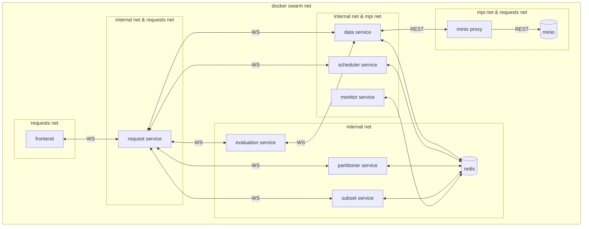

# Distributed Model on Demand (DMOD)

DMOD is an extensible suite of software tools for creating and running specialized compute environments (and in some sense the environments themselves).
The primary goal for DMOD is to make it easier to develop, test, and experiment with scientific models, with particular emphasis on models run through the [NextGen framework](https://github.com/noaa-owp/ngen).

As of Fall 2023, the project is in an early Beta stage.
Infrastructure and workflows have been initially developed with the [NextGen framework](https://github.com/NOAA-OWP/ngen) in mind, though the intent is to work toward a generalized design.

[//]: # (- Code Organization)
[//]: # (- Workflows)
[//]: # (- Technology Stack)

## Architecture Overview

The below diagram shows an architecture overview of a fully deployed DMOD. Rounded boxes represent
services. Lines that connect boxes represent communication between services and optionally inline
text specifies the transport protocol used (e.g. WS - WebSocket). Subgraphs (e.g. `requests net`)
represent one or more Docker networks and show the networks a service is a member of.

## Services and Stacks

<!-- - Data Request service -->
- Data service - Primary data and metadata store that houses model input, output, and evaluation data. This service is also responsible for creating Docker volumes to support model execution job environments (e.g. model input data).
- Evaluation service - 
- Monitor service - Monitors and updates the status of model execution job environments.
- Partitioner service - Partitions NextGen hydrofabric domains to enable parallel execution (mpi) of NextGen model runs.
- Request service - API gateway that coordinates communication with DMOD backend services.
- Scheduler service - Schedules and commences model execution jobs and their associated environments.
<!-- - Subset service -->

### Stacks

- GUI
- Main
- Object store

## Networks

- Internal - Primary network for service to service communication
- MPI - Network in which model execution environments and related services communicate
- Requests - Ingress network

## Dependencies

The primary dependencies for this project are Docker, Minio, PostgreSQL, Python, and Redis.

More detailed information can be found on the [Dependencies](doc/DEPENDENCIES.md) page.
Python package dependencies can be found in [`requirements.txt`](requirements.txt)

## Installation

The basic process is:
- Install project [dependencies](doc/DEPENDENCIES.md)
  - Optionally, setup and use a [dedicated Python virtual environment](INSTALL.md#using-a-virtual-environment) (highly recommended)
- Create a [customized local environment config](INSTALL.md#local-environment-configuration)
- Set up the [required SSL certificates](INSTALL.md#local-ssl-certs)
- Build and install necessary [internal Python packages](INSTALL.md#python-packages-and-dependencies) into Python environment, typically using the [provided helper script](#using-update_packagesh-for-dependencies-and-internal-packages)
- [Build Docker images](INSTALL.md#docker-images)

See the [INSTALL](INSTALL.md) document for more information.

[//]: # (TODO: add this section, and probably a dedicated document)
[//]: # (## Configuration)

[//]: # (TODO: add this section, and also a dedicated document)
[//]: # (## Usage)

[//]: # (TODO: add this section, and also a dedicated document)
[//]: # (## Testing)

[//]: # (TODO: add this section, and probably a dedicated document)
[//]: # (## Getting help)

[//]: # (Instruct users how to get help with this software; this might include links to an issue tracker, wiki, mailing list, etc.)

[//]: # (**Example**)

[//]: # (If you have questions, concerns, bug reports, etc, please file an issue in this repository's Issue Tracker.)

## Getting involved
See the [CONTRIBUTING](CONTRIBUTING.md) document for details.

----

## Open source licensing info
1. [TERMS](TERMS.md)
2. [LICENSE](LICENSE)

----

## Credits and references

Inspired by [WALKOFF](https://github.com/nsacyber/WALKOFF)
