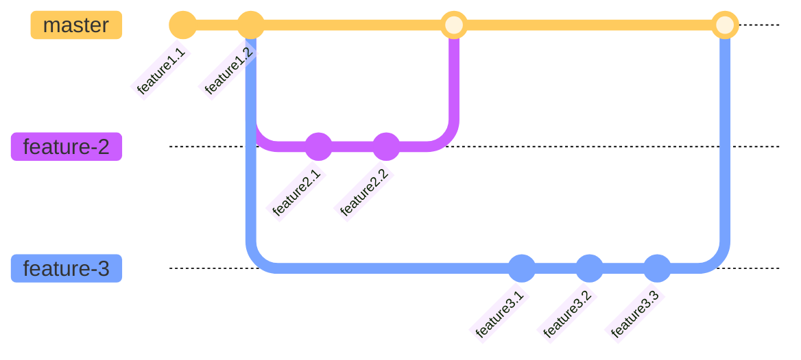
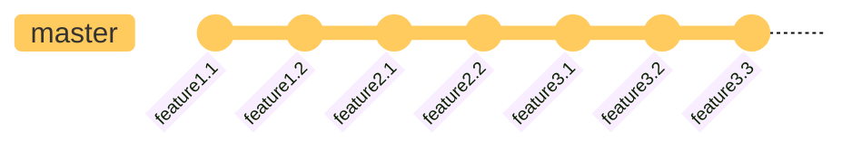
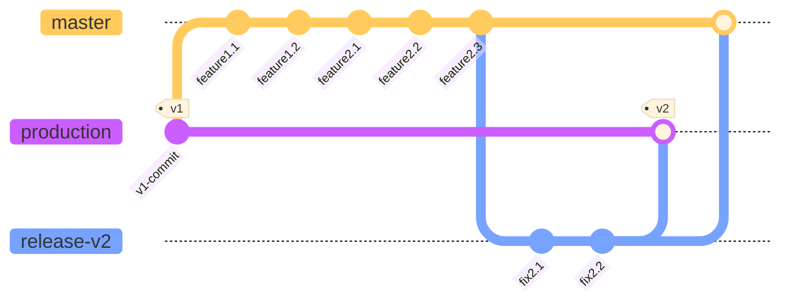
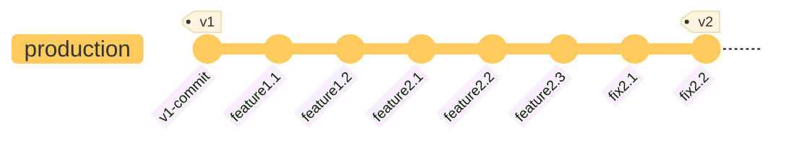
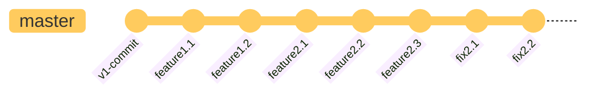

# Git Strategy

- [Branching Design](#branching-design)
  - [Feature Branches from `master`](#feature-branches-from-master)
  - [Relating `production`, `master`, and Release Branches](#relating-production-master-and-release-branches)
- [Contributing](#contributing)
    - [TL;DR](#contributing-tldr)
    - [Getting Started With Your Fork](#getting-started-with-your-fork)
      - [Fork Consistency Requirements](#fork-consistency-requirements)
      - [Fork Setup Suggestions](#fork-setup-suggestions)
    - [Development](#development)
    - [Submitting Pull Requests](#submitting-pull-requests)
- [Keeping Forks Up to Date](#keeping-forks-up-to-date)
    - [Getting Upstream Changes](#getting-upstream-changes)
    - [Rebasing Development Branches](#rebasing-development-branches)
    - [Fixing Diverging Development Branches](#fixing-diverging-development-branches)
- [Optional: Setting Up Hook Scripts](#optional-setting-up-hook-scripts)

## Branching Model

- The DMOD repo uses a branching model based on [Gitflow](https://nvie.com/posts/a-successful-git-branching-model/) and has two primary long-term branch: 
  - **master**: the main development and integration branch containing the latest completed development work intended for the next released version
  - **production**: the branch representing the latest code verified as production-ready and pointing to the most recently release, official version
- Most interaction with DMOD repo is done via pull requests (PRs) to the `master` branch
  - Independent branches for features or bug fixes are created off `master` to contain development work that is in progress
  - These branches are reviewed and their changes integrated back into `master` once complete via PRs
  - Typically feature/fix branches exist in personal clones and personal Github forks, but not in the official OWP repo
- Release branches (e.g., `release-X` for pending version `X`) will periodically be created to finalize the next new version when it is time for it to be released
  - These are managed by the core OWP contributors team
  - They do exist in the official OWP repo
  - But they are short-lived and removed once the release becomes official
  - See the [Release Management](RELEASE_MANAGEMENT.md) doc for more details on the release process

### Feature Branches from `master`
This illustrates the relationship between feature branches and `master`.  They should be created from `master` and independently contain commits from their feature.  Once done, the changes will be reintegrated back into `master` via rebasing.



The resulting state of `master` after rebasing the two new feature branches would be:



### Relating `production`, `master`, and Release Branches

This illustrates the relationship between `production`, `master`, and `release-v2`.  Notice that `production` has already been tagged with version `v1` at the start.  Commits for `feature1` and `feature2` at some point are integrated into `master`.  When it is time to prepare to release version `v2`, `release-v2` is created.  A few bug fix commits were needed in `release-v2`.  After that, all the changes in `release-v2` are integrated into `production`, and `production` is tagged `v2`.  All the changes are also integrated back into `master`.




The resulting state of `production` is:



The resulting state of `master` is essentially the same:




## Contributing

- [TL;DR](#contributing-tldr)
- [Getting Started With Your Fork](#getting-started-with-your-fork)
  - [Fork Consistency Requirements](#fork-consistency-requirements)
  - [Fork Setup Suggestions](#fork-setup-suggestions)
- [Development](#development)
- [Submitting Pull Requests](#submitting-pull-requests)

### Contributing TL;DR

To work with the repo and contribute changes, the basic process is as follows:

- Create your own DMOD fork in Github
- Clone DMOD locally (conventionally from your fork) and [setup your repo on your local development machine](#getting-started-with-your-fork)
- Make sure to [keep your fork and your local clone(s) up to date](#keeping-forks-up-to-date) with the upstream OWP DMOD repo, [ensuring histories remain consistent](#fork-consistency-requirements) by performing [rebasing](#rebasing-development-branches)
- Create feature/fix branches from `master` when you want to contribute
- Write changes you want to contribute, commit to your local feature/fix branch, and push these commits to a branch in your personal Github fork
- Submit pull requests to the OWP DMOD repo's `master` from a branch in your fork when this branch has a collection of changes ready to be incorporated

### Getting Started With Your Fork

After [creating a fork](https://docs.github.com/en/pull-requests/collaborating-with-pull-requests/working-with-forks/fork-a-repo) in Github, [clone a local development repo](https://docs.github.com/en/repositories/creating-and-managing-repositories/cloning-a-repository).  The convention is to clone this local repo from a personal fork, which causes the personal fork to be configured as the `origin` remote.  There are more advanced ways of doing things, which won't be detailed here, but the rest of this document assumes the aforementioned setup.

Add the OWP DMOD repo as a second remote for the local clone. Again, the standard convention used in this doc and elsewhere is to name that remote `upstream`.  Doing the addition will look something like:

    # Add the remote
    git remote add upstream https://github.com/NOAA-OWP/DMOD.git

    # Verify
    git remote -v

Set up a local user and email in the local repo's configuration.

    cd local_repo_directory
    git config user.name "John Doe"
    git config user.email "john@doe.org"

Alternatively, one could also set these in the machine's global Git config (or rely upon the global settings if already configured).

     git config --global user.name "John Doe"
     git config --global user.email "john@doe.org"

#### Fork Consistency Requirements

As mentioned, to contribute changes, the changes must be submitted via a pull request.  The branch used for a pull request usually needs to be (re)based on the `HEAD` commit of the current OWP `upstream/master` branch, to ensure the repo history remains consistent.  

This is a bit of a moving target:  sometimes, a relatively recent commit (not the latest `HEAD`) will be sufficient.  Other times, the most recent `HEAD` will be used initially, but then change after the PR was submitted and need to be rebased again. 

Regardless, if there are merge conflicts in the branch within a PR, the branch will need to be rebased on `upstream/master` again.  

#### Fork Setup Suggestions

Note that while this setup is not strictly required, examples and instructions in this document may assume its use.

Maintain a personal `master` branch, on any local development clones and within a personal fork, just as [a place to rebase changes from `upstream/master`](#getting-upstream-changes).  Do not do any development work or add any commits to these directly.  Just keep these as a "clean," current copy of the `upstream/master` branch.

Create separate feature/bug fix branches for development work as appropriate, basing them off the local copy of `master`.  When preparing to make a PR, making sure the branch is both up to date with `upstream/master` and has all the desired local changes.

A separate, "clean" local `master` should be easy to keep it in sync with `upstream/master`, which in turn will make it relatively easy to rebase local development branches on `master` whenever needed.  This simplifies maintaining the base-commit consistency requirement for the branches used for pull requests.

Clean up above-mentioned PR branches regularly (i.e., once their changes get incorporated).  This is generally a good practice for other local or fork development branches, to avoid having [diverged histories that need to be fixed](#fixing-diverging-development-branches).

### Development

Start by creating and checking out a local branch (`new_branch`) to contain your work.  This should be based on `master` (you may need to [sync upstream changes](#getting-upstream-changes) first):

```bash
git checkout -b new_branch master
```

From there begin writing and committing your changes to the branch.  While up to you, it is suggested that development work be committed frequently when changes are complete and meaningful. If work requires modifying more than one file in the source, it is recommended to commit the changes independently to help avoid too large of conflicts if/when they occur.


### Submitting Pull Requests

Once changes being developed in a local feature/fix branch are ready, the branch and all local commits should be pushed to your Github fork.

    # If you haven't yet pushed the branch to the fork (and assuming your fork is `origin`)
    git push -u origin my_branch

Alternatively, if the branch is already in your fork and just needs the latest local commits:

    git push origin my_branch

(**Note**: the `-u` option and more explicit syntax being used above are perfectly valid but not completely necessary.  Set Git's documentation for more about the `push` command.)

After everything is in your fork, you can navigate to the OWP repo via Github's web interface and [submit a PR](https://docs.github.com/en/pull-requests/collaborating-with-pull-requests/proposing-changes-to-your-work-with-pull-requests/creating-a-pull-request) to pull this branch into the OWP `master` branch.  Ensure that you select `master` as the recipient branch.  You will also need to make sure you are comparing across forks, choosing your appropriate fork and branch to pull from.  Complete details on the process can be found in Github's documentation.

#### PR Revisions

Once the PR is submitted, it will be reviewed by one or more other repo contributors.  Potentially, changes could be requested, in which case you would need to first make those in your locally copy of the feature/fix branch, and then re-push that branch (and the updates) to your personal fork.

## Keeping Forks Up to Date

- [A Rebase Strategy](#a-rebase-strategy)
- [Getting Upstream Changes](#getting-upstream-changes)
- [Rebasing Development Branches](#rebasing-development-branches)
- [Fixing Diverging Development Branches](#fixing-diverging-development-branches)


To remain consistent with changes to the official OWP DMOD repo (i.e., the **upstream** repo), a developer will need to regularly synchronize with it.  This requires having an `upstream` remote configured, as described in the section on [getting started with your fork and local repo](#getting-started-with-your-fork).

### A Rebase Strategy

The development team for DMOD uses a *rebase* strategy for integrating code changes, rather than a *merge* strategy.  More information on rebasing is [available here](https://git-scm.com/book/en/v2/Git-Branching-Rebasing), but the main takeaway is that it is important all changes are integrated into branches using this approach.  Deviation from this will likely cause a bit of mess with branch commit histories, which could force rejection of otherwise-good PRs.


### Getting Upstream Changes

When it is time to check for or apply updates from the official OWP repo to a personal fork and/or a local repo, check out the `master` branch locally  and do fetch-and-rebase, which can be done with `pull` and the `--rebase` option:

    # Checkout local master branch
    git checkout master

    # Fetch and rebase changes
    git pull --rebase upstream master

Then, make sure these get pushed to your personal fork. Assuming [the above-described setup](#getting-started-with-your-fork) where the local repo was cloned from the fork, and assuming the local `master` branch is currently checked out, the command for that is just:

    # Note the assumptions mentioned above that are required for this syntax
    git push

Alternatively, you can use the more explicit form:

`git push <fork_remote> <local_branch>:<remote_branch>`

The previous example command is effectively equivalent to running:

    # Cloning a repo from a fork created a remote for the fork named "origin"; see above assumptions
    git push origin master:master

You also can omit `<local_branch>:` (including the colon) and supply just the remote branch name if the appropriate local branch is still checked out.

#### For `production` Too

Note that the above steps to get upstream changes from the official OWP repo can be applied to the `production` branch also (just swap `production` in place of `master`).  `production` should not be used as the basis for feature/fix branches, but there are other reasons why one might want the latest `production` locally or in a personal fork.  

### Rebasing Development Branches

When the steps in [Getting Upstream Changes](#getting-upstream-changes) do bring in new commits that update `master`, it is usually a good idea (and often necessary) to rebase any local feature/fix branches were previously created. E.g.,

    # If using a development branch named 'faster_dataset_writes'
    git checkout faster_dataset_writes
    git rebase master

See documentation on [the "git rebase" command](https://git-scm.com/docs/git-rebase) for more details.

#### Interactive Rebasing

It is possible to have more control over rebasing by doing an interactive rebase.  E.g.:

    git rebase -i master

This will open up a text editor allowing for reordering, squashing, dropping, etc., development branch commits prior to rebasing them onto the new base commit from `master`.  See the [**Interactive Mode**](https://git-scm.com/docs/git-rebase#_interactive_mode) section on the rebase command  for more details.

### Fixing Diverging Development Branches

If a local feature/fix branch is already pushed to a remote fork, and then later rebasing the local branch is necessary, doing so will cause the histories to diverge.  For simple cases, the fix is to just force-push the rebased local branch.

    # To force-push to fix a divergent branch
    git push -f origin feature_branch

However, extra care is needed if multiple developers may be using the branch in the fork (e.g., a developer is collaborating with someone else on a large set of changes for some new feature).  The particular considerations and best ways to go about things in such cases are outside the scope of this document.  Consult Git's documentation and Google, or contact another contributor for advice.

## Optional: Setting Up Hook Scripts

_Git_ supports the capability to automatically run various scripts when certain events happen.  These are referred to as [_Git_ hooks](https://git-scm.com/book/en/v2/Customizing-Git-Git-Hooks).  Use of these hooks is optional but recommended.  However, client-side hooks are not copied as part of cloning a repository.  They must be set up either manually or, [as discussed next](#integration-with-_pre-commit_-utility), via some other helper tool.

### Integration with _pre-commit_ Utility

The DMOD repo does contain a configuration for a related helper utility named [_pre-commit_](https://pre-commit.com/).  This tool can be used to manage and install scripts for use with _Git_'s `pre-commit` hook.  The `pre-commit` hook runs automatically when `git commit` is invoked and can be used to perform valuable checks on the files in the repo.

#### Installing _pre-commit_

The _pre-commit_ utility must be installed as a separate step.  Installation can be performed using a package manager (e.g. `brew install pre-commit`) or from _pip_.  If you are to use _pip_, it is highly recommend to use a virtual environment.

#### Provided Configuration

The [`.pre-commit-config.yaml`](./.pre-commit-config.yaml) file in the root of the repo provides a DMOD-maintained configuration of hook scripts that _pre-commit_ (the utility) will add to the `pre-commit` _Git_ hook.  This file is version controlled and can be changed like any other source file.

#### Installing Hook Scripts Using _pre-commit_

Once the utility is available, install the _pre-commit_-configured hook scripts into your _Git_ clone by running:

```shell
pre-commit install
```

The hook scripts will now run when code is committed.  

Alternatively, you can run the hook scripts manually via:

```shell
pre-commit run --all-files
```

For more information, see [_pre-commit_'s documentation](https://pre-commit.com/index.html).