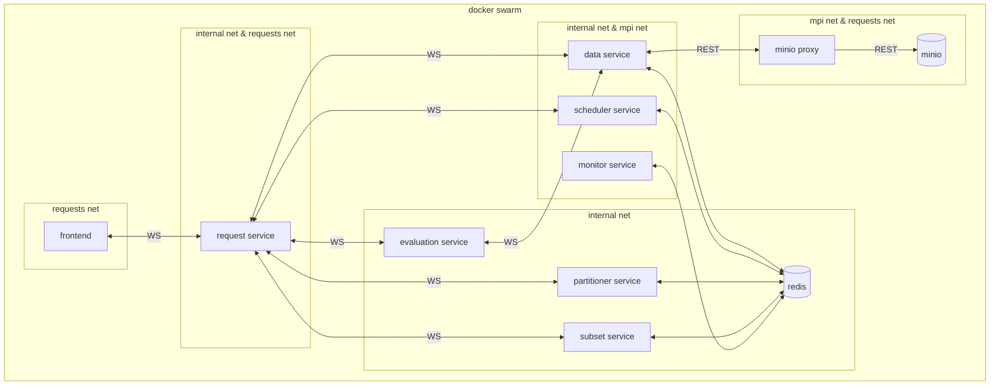

```mermaid
flowchart TB

%% "datarequest service" %% I dont think we use this?

subgraph docker swarm

gui <-- WS --> rs

%% backend requests
rs <-- WS --> ds
rs <-- WS --> scs
rs <-- WS --> ps
rs <-- WS --> sus
rs <-- WS --> es

ds <-- REST --> minio_proxy

minio_proxy -- REST --> minio

ds <--> redis
scs <--> redis
ps <--> redis
sus <--> redis
ms <--> redis

es <-- WS --> ds


subgraph requests net
%% requests
gui["frontend"]
end

subgraph "internal net & mpi net"
%% mpi, internal
ds["data service"]

%% mpi, internal
scs["scheduler service"]

%% mpi, internal ?? ask Bobby; I dont think this is in use
ms["monitor service"]
end

subgraph "internal net & requests net"
%% requests, internal
rs["request service"]

end

subgraph internal net
%% internal
redis[("redis")]

%% internal
ps["partitioner service"]

%% internal
sus["subset service"]

%% internal?
es["evaluation service"]
end

%% subgraph mpi network
%% end


subgraph "mpi net & requests net"
%% mpi, requests
minio[("minio")]

%% mpi, requests
minio_proxy["minio proxy"]
end

end
```
