# Specification

Evaluation workflows are highly configurable via the use of required evaluation specifications. There are a lot
of different options, but this level of complexity may be mitigated through the use of [templates](#templates).

## Table of Contents

- [A Word on Templates](#templates)
- [Querying Data](#querying)
- [Evaluation Specification](#EvaluationSpecification)
    - [Examples](#EvaluationSpecificationExamples)
- [Data Source Specification](#DataSourceSpecification)
    - [Examples](#DataSourceSpecificationExamples)
- [Backend Specification](#BackendSpecification)
    - [Examples](#BackendSpecificationExamples)
- [Associated Field](#AssociatedField)
    - [How to Use Paths](#AssociatedFieldPaths)
    - [Examples](#AssociatedFieldExamples)
- [Field Mapping Specification](#FieldMappingSpecification)
    - [Examples](#FieldMappingSpecificationExamples)
- [Value Selector](#ValueSelector)
    - [How to Use Paths](#ValueSelectorPaths)
    - [Examples](#ValueSelectorExamples)
- [Crosswalk Specification](#CrosswalkSpecification)
    - [Examples](#CrosswalkSpecificationExamples)
- [Location Specification](#LocationSpecification)
    - [Examples](#LocationSpecificationExamples)
- [Metric Specification](#MetricSpecification)
    - [Examples](#MetricSpecificationExamples)
- [Threshold Specification](#ThresholdSpecification)
    - [Examples](#ThresholdSpecificationExamples)
- [Threshold Definition](#ThresholdDefinition)
    - [Examples](#ThresholdDefinitionExamples)
- [Threshold Application Rules](#ThresholdApplicationRules)
    - [Examples](#ThresholdApplicationRulesExamples)
- [Unit Definition](#UnitDefinition)
    - [Examples](#UnitDefinitionExamples)
- [Scheme Specification](#SchemeSpecification)
    - [Examples](#SchemeSpecification)
- [All Specification Elements](#all-elements)

<a id="templates"></a>
## A word on templates

Templating in evaluation specifications is a means of using preconfigured logic within new configurations.
Many configurations may be the same or they may be mostly the same. Configuring full or partial configurations
and attaching a template name to a configuration will apply the template settings prior to the application of
passed configurations.

Templates are supported on any model that has the `template_name` property. To use an existing template,
all that must be done to include it is to set the value of `template_name` to it:

```json
{
    "observations": [
        {
            "template_name": "Observation Template"
        }
    ]
}
```

Templates are environment specific - one environment may have an important template while another might not,
but the templates are configurable, so more and more may be created as new use cases arise. Template Manager
constructs (such as the [FileTemplateManager](template.py)) provide all the means necessary to find out what templates are
available. Services providing access to evaluations should provide querying capabilities so that templates may be
reused as much as possible.

<a id="querying"></a>
## Querying Data

Structured data, such as with JSON, may be queried with the help of [JSONPath](https://goessner.net/articles/JsonPath/),
a query language used as an analog to [XPaths](https://en.wikipedia.org/wiki/XPath).

Given a document like:

```json
{
    "a": 5,
    "b": [
        {
            "value1": 1,
            "value2": {
                "value3": "This is another value"
            },
            "value3": false
        },
        {
            "value1": 2,
            "value2": {
                "value3": "This is yet another value that we'll use as an example"
            },
            "value3": true
        },
        {
            "value1": 47,
            "value2": {
                "value3": "Look at this awesome value!"
            },
            "value3": true
        }
    ]
}
```

the query `"$.b[1].value2.value3"` will yield '"This is yet another value that we'll use as an example"'. The
`$` character instructs the search operations to start looking at the root of the document. The next instruction,
`b` tells the search operation to look for values under `b`. `[1]` tells the operation to then look in the 
second member of the collection held under `b`. `value2` tells the search process to _then_ search under the `value2` 
object where the final `value3` instruction retrieves the value belonging to `value3`.

The equivalent hardcoded instructions in python would be:

```python
example = {
    "a": 5,
    "b": [
        {
            "value1": 1,
            "value2": {
                "value3": "This is another value"
            },
            "value3": False
        },
        {
            "value1": 2,
            "value2": {
                "value3": "This is yet another value that we'll use as an example"
            },
            "value3": True
        },
        {
            "value1": 47,
            "value2": {
                "value3": "Look at this awesome value!"
            },
            "value3": True
        }
    ]
}

equivalent_value = example['b'][1]['value2']['value3']
print(equivalent_value)
# Output: This is yet another value that we'll use as an example
```

Queries don't have to start at the root, but it _is_ advised. a query such as `"value1"` would yield `[1, 2, 47]`, but
a query of `"value3"` would yield `["This is another value", false, "This is yet another value that we'll use as an 
example", true, "Look at this awesome value!", true]`.

Investigate [Associated Fields](#AssociatedField) and [Value Selectors](#ValueSelector) to see how paths are used in 
practice. 

<a id="EvaluationSpecification"></a>
## Evaluation Specification

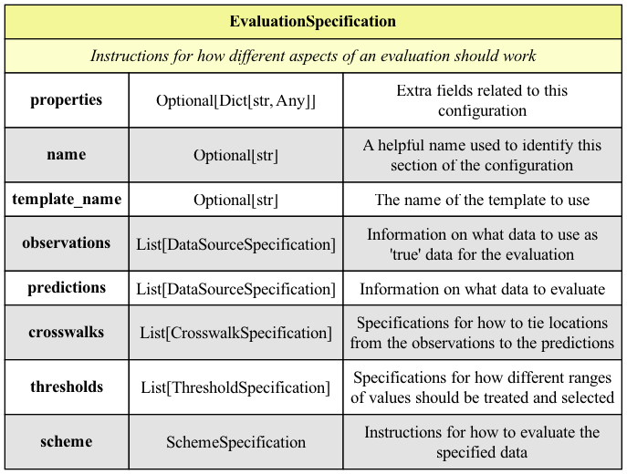

The [Evaluation Specification](evaluation.py) is the primary unit of configuration required in order to carry
out evaluations. This element contains every bit of needed information, from where to load what data to what
metrics to run on it. Each evaluation will require one and only one evaluation specification.

<a id="DataSourceSpecification"></a>
## Data Source Specification

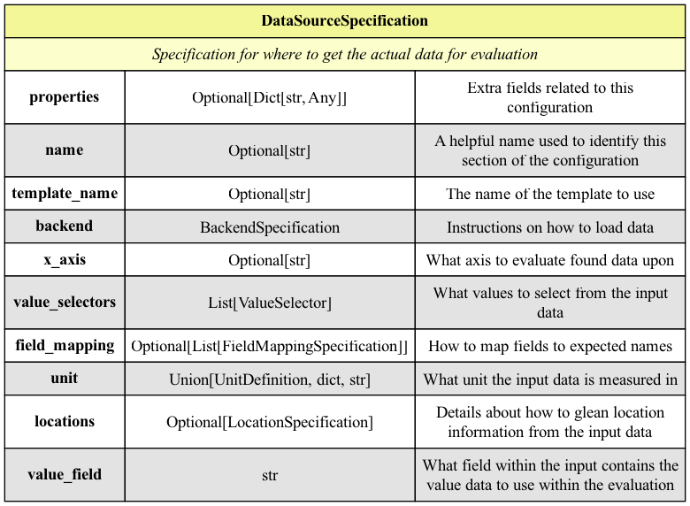

The [Data Source Specification](data.py) is the block of configuration responsible for loading a set of data
that will be joined with others for evaluation. Loading data by using instructions provided by a `DataSourceSpecification`
will yield a Data Frame that will be ready for manipulation.

The most important aspects defined by a `DataSourceSpecification` are:

1. What fields to load
2. What the data is [measured in or how to find out](#unit-definition)
3. What locations are represented within the data or how to find out
4. How to load and interpret the raw data
5. What field within the resultant data should be used for all calculations.

<a id="BackendSpecification"></a>
## Backend Specification

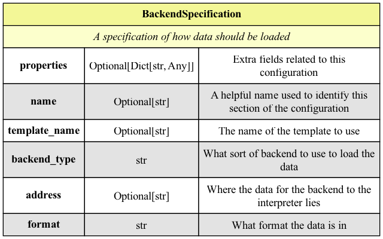

[Backend Specifications](backend.py) dictate how data is loaded. As of writing, there are two different
backend types: files and `REST`. Unlike a lot of the other configuration types, the `properties` attribute may be
truly important in that some readers require extra information. `REST` calls may require extra parameters.
For instance, reaching out to NWIS for isntantaneous streamflow data may require information, such as a comma
delimited list of sites to retrieve data for, a `startDT` and `endDT` to indicate the timeframe for what data to
retrieve, and `parameterCd`, which will dictate what data to pull back (`00060` would be streamflow).

Expect these parameters to be more important to services than local files due to the further complexity due to
querying.

<a id="BackendSpecificationExamples"></a>
### Example
Load a local RDB file stored at "resources/nwis_stat_thresholds.rdb":
```json
{
    "backend_type": "file",
    "format": "rdb",
    "address": "resources/nwis_stat_thresholds"
}
```

Retrieve streamflow data from NWIS' Instantaneous Values service for locations "0214657975" and
"0214655255", with values ocurring between midnight 2022-12-01 and midnight 2022-12-31:
```json
{
    "backend_type": "rest",
    "format": "json",
    "address": "https://nwis.waterservices.usgs.gov/nwis/iv",
    "params": {
        "format": "json",
        "indent": "on",
        "sites": "0214657975,0214655255",
        "startDT": "2022-12-01T00:00%2b0000",
        "endDT": "2022-12-31T00:00%2b0000",
        "parameterCd": "00060"
    }
}
```

Use the "Instantaneous NWIS Streamflow" template to retrieve streamflow data from location "0214657975"
from between midnight 2023-09-01 and midnight 2023-09-14:
```json
{
    "template_name": "Instantaneous NWIS Streamflow",
    "params": {
        "sites": "0214657975",
        "startDT": "2023-09-01T00:00%2b0000",
        "endDT": "2023-09-14T00:00%2b0000"
    }
}
```

Retrieve data "path/to/file.json" in the style handled by the "JSON File" template
```json
{
    "template_name": "JSON File",
    "address": "path/to/file.json"
}
```

<a id="AssociatedField"></a>
## Associated Field

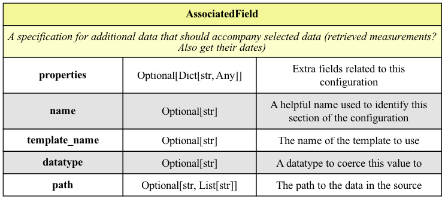

Configuring [Associated Fields](fields.py) helps dictate what data should be placed with the selected values.
Retrieving data via a [Value Selector](#ValueSelector) might return a series of values, but may not contain the
collection of values necessary for context. For example, selecting values in NWIS JSON may be performed by gathering
data from `"values[*].value[*].value"`, but that doesn't tell you _when_ those values occurred. If you associate
those values with the date times from `"values[*].value[*].dateTime"`, however, you'll now have a set of data containing
values _and_ context.

<a id="AssociatedFieldExamples"></a>
### Example

Use data at `sourceInfo.siteCode[0].value`, starting from the current origin, as the accompanying location
for the currently identified measurement
```json
{
    "name":"observation_location",
    "path": ["sourceInfo", "siteCode", "[0]", "value"],
    "datatype": "string"
}
```

Consider the adjacent `date` field as a `datetime` object for read measurements
```json
{
    "name": "date",
    "datatype": "datetime"
}
```

<a id="FieldMappingSpecification"></a>
## Field Mapping Specification

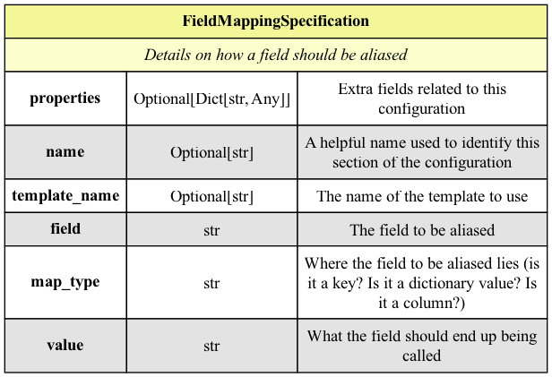

Field mapping allows the renaming of fields that will appear during evaluation and in outputs. Some sources provide
hard to understand or uncommon names. For instance, some inputs will have a variable with the name `Q_out` that
will need to be used alongside data named `streamflow` or `discharge`. Renaming fields allow for common terms
across a multitude of different types of evaluations and allow for easier downstream tooling.

<a id="FieldMappingSpecificationExamples"></a>
### Example

Rename the "date" field as "value_date" for processing
```json
{
    "field": "value_date",
    "map_type": "column",
    "value": "date"
}
```

Consider the value of "site_no" as the field named "location"
```json
{
    "field": "location",
    "map_type": "value",
    "value": "site_no"
}
```

<a id="ValueSelector"></a>
## Value Selector

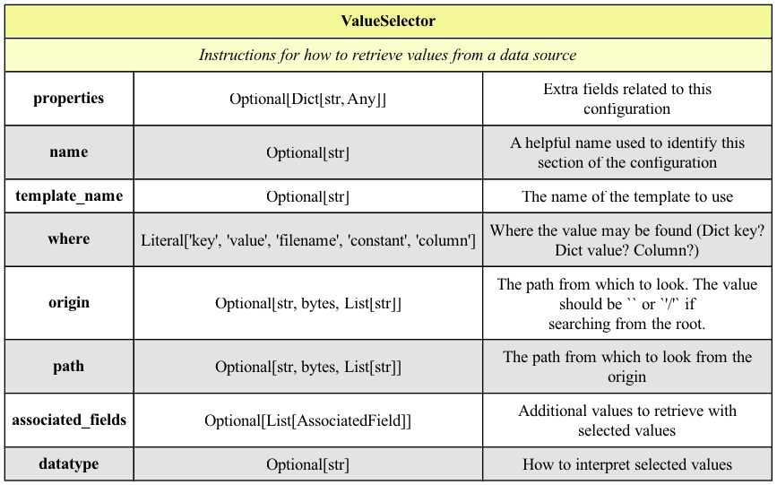

[Value Selectors](fields.py) are the most important part of any data source configuration: they define what fields
should be loaded and how. Data that has been loaded from a backend may provide raw values, but it is the job
of Value Selectors to investigate that data and extract what to use. Say a CSV file is used and it contains fields like
`d`, `flow`, `temperature`, `dew point`, `age`, `altitude`, `loc`, `turpidity`, `region`, `state`, `operator`, and 
`stage`, that looks like:

| d                | flow | temperature | dew point | age | altitude | loc               | turpidity | region | state | operator | stage |
|------------------|------|-------------|-----------|-----|----------|-------------------|-----------|--------|-------|----------|-------|
| 2023/10/01 00:00 | 37.8 | 25          |           | 45  | 1054.24  | SOME LOCATION, AL | `null`    | SERFC  | AL    | USACE    | 14    |
| 2023/10/01 01:00 | 37.6 | 24.8        |           | 55  | 1054.24  | SOME LOCATION, AL | `null`    | SERFC  | AL    | USACE    | 13    |


A configuration like:

```json
{
    "name": "streamflow",
    "where": "column",
    "path": "flow",
    "datatype": "float",
    "associated_fields": [
        {
            "name": "value_date",
            "path": "d",
            "datatype": "datetime"
        },
        {
            "name": "location",
            "path": "loc",
            "datetype": "string"
        }
    ]
}
```

will transform that into:

| value_date               | streamflow | location          |
|--------------------------|------------|-------------------|
| 2023-10-01 00:00:00-0000 | 37.8       | SOME LOCATION, AL |
| 2023-10-01 01:00:00-0000 | 37.6       | SOME LOCATION, AL |

<a id="ValueSelectorExamples"></a>
### Example

Use each value located at `"values[*].value[*].value"`, starting from every node found at
`"$.value.timeSeries[*]"` as a floating point number used for a field named `observation`. When selecting that value,
also select `"values[*].value[*].datetime"` as a `datetime` field named `"value_date"`, `"sourceInfo.siteCode[0].value"`
as a string for a field named 'observation_location', and `"variable.unit.unitCode"` as a string field named "unit".

```json
{
    "name": "observation",
    "where": "value",
    "path": ["values[*]", "value[*]", "value"],
    "datatype": "float",
    "origin": ["$", "value", "timeSeries[*]"],
    "associated_fields": [
        {
            "name":"value_date",
            "path": ["values[*]", "value[*]", "dateTime"],
            "datatype": "datetime"
        },
        {
            "name":"observation_location",
            "path": ["sourceInfo", "siteCode", "[0]", "value"],
            "datatype": "string"
        },
        {
            "name":"unit",
            "path": ["variable", "unit", "unitCode"],
            "datatype": "string"
        }
    ]
}
```

This will select values that might look like:

| observation | value_date                    | observation_location | unit  |
|-------------|-------------------------------|----------------------|-------|
| 46.9        | 2015-11-30T20:00:00.000-05:00 | 0214655255           | ft3/s |
| 50.2        | 2015-11-30T20:05:00.000-05:00 | 0214655255           | ft3/s |
| 48.2        | 2015-11-30T20:10:00.000-05:00 | 0214655255           | ft3/s |

The following might yield the same result:
```json
{
    "name": "observation",
    "where": "value",
    "path": ["values[*]", "value[*]", "value"],
    "datatype": "float",
    "origin": ["$", "value", "timeSeries[*]"],
    "associated_fields": [
        {
            "template_name": "NWIS Value Date"
        },
        {
            "template_name": "NWIS Observation Location"
        },
        {
            "template_name": "NWIS Unit"
        }
    ]
}
```

Use the column named '"predicted"' and match it with the adjacent column named '"date"':
```json
{
    "name": "predicted",
    "where": "column",
    "associated_fields": [
        {
            "name": "date",
            "datatype": "datetime"
        }
    ]
}
```

<a id="CrosswalkSpecification"></a>
## Crosswalk Specification

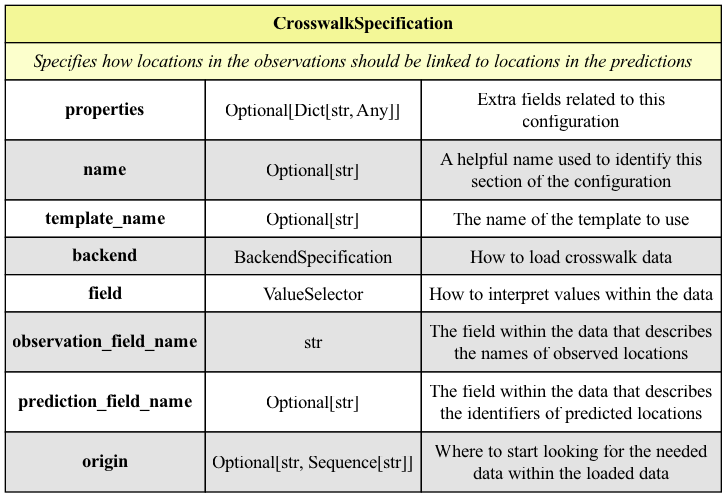

[Crosswalk Specifications](locations.py) inform the system about how it should link observations to forecasts based
on location by loading up data to link

Say you have the following two data sets:

**Predictions**

| loc | value | unit   | time              |
|-----|-------|--------|-------------------|
| 1   | 324   | ft3/s  | 2021-10-14 00:00  |
| 1   | 322   | ft3/s  | 2021-10-14 01:00  |
| 2   | 14    | ft3/s  | 2021-10-14 00:00  |
| 2   | 13    | ft3/s  | 2021-10-14 01:00  |

**Observations**

| site_no    | measurement | unit  | stage | valid_time       |
|------------|-------------|-------|-------|------------------|
| 0446846846 | 14          | cms   | 8     | 2021-10-14 00:00 |
| 0446846846 | 18          | cms   | 9     | 2021-10-14 01:00 |
| 668465168  | 7           | cms   | 5     | 2021-10-14 00:00 |
| 668465168  | 6           | cms   | 4.8   | 2021-10-14 01:00 |


A Crosswalk Specification like:
```json
{
    "backend": {
        "backend_type": "file",
        "address": "resources/crosswalk.json",
        "format": "json"
    },
    "observation_field_name": "site_no",
    "prediction_field_name": "loc",
    "field": {
        "name": "loc",
        "where": "key",
        "path": ["* where site_no"],
        "origin": "$",
        "datatype": "string",
        "associated_fields": [
            {
                "name": "site_no",
                "path": "site_no",
                "datatype": "string"
            }
        ]
    }
}
```

will read the data from `"resources/crosswalk.json"` that looks like:

```json
{
    "1": {
        "value1": 1,
        "site_no": "668465168"
    },
    "2": {
        "value1": 2,
        "site_no": "0446846846"
    },
    "3": {
        "value1": 3
    },
    "4": {
        "value1": 4
    }
}
```

And determine that rows from the **Prediction** dataset with a `loc` value of `1` should link to rows from the 
**Observation** dataset with a `site_no` value of `668465168`. The keys `"3"` and `"4"` will be totally ignored since 
the path `* where site_no` means "Everything that has a member named `site_no`" and `"3"` and `"4"` lack the member.

<a id="CrosswalkSpecificationExamples"></a>
### Examples

Load the local `JSON` file at "resources/crosswalk.json" and extract the keys found at `"* where site_no"`
(everything that has a `site_no` field) to use as a "prediction_location" and use its contained value
`"site_no"` as a field named "observation_location":
```json
{
    "backend": {
        "backend_type": "file",
        "address": "resources/crosswalk.json",
        "format": "json"
    },
    "observation_field_name": "observation_location",
    "prediction_field_name": "prediction_location",
    "field": {
        "name": "prediction_location",
        "where": "key",
        "path": ["* where site_no"],
        "origin": "$",
        "datatype": "string",
        "associated_fields": [
            {
                "name": "observation_location",
                "path": "site_no",
                "datatype": "string"
            }
        ]
    }
}
```

Using templates, this may be represented as:
```json
{
    "backend": {
        "template_name": "JSON File",
        "address": "resources/crosswalk.json"
    },
    "observation_field_name": "observation_location",
    "prediction_field_name": "prediction_location",
    "field": {
        "template_name": "Prediction Key to Observed Site Crosswalk"
    }
}
```

This might yield something that looks like:

| observation_location | prediction_location |
|----------------------|---------------------|
| 0214655255           | cat-52              |
| 02146562             | cat-67              |
| 0718735243           | cat-27              |

The following JSON will instruct evaluations to pair observed data to predicted data where the observation's
`observation_location` field matches the indicated value in the prediction's `predicted_location` field:

```json
{
    "observation_field_name": "observation_location",
    "prediction_field_name": "prediction_location"
}
```

<a id="LocationSpecification"></a>
## Location Specification

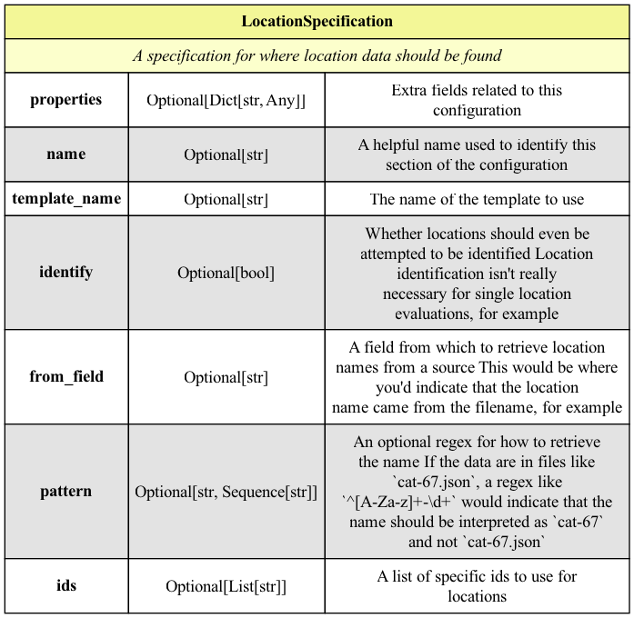

[Location Specifications](locations.py) define where to find identifiers for locations within and without loaded data.
Some data may have locations on columns, some may have locations in filenames. 

<a id="LocationSpecificationExamples"></a>
### Example

Identify locations as those being from the `site_no` column:
```json
{
    "identify": true,
    "from_field": "site_no"
}
```

Identify location names based on the filename from files with names like `cat-27` and `cat-52` from files
like `cat-27.csv` and `cat-52_cms.csv`:
```json
{
    "identify": true,
    "from_field": "filename",
    "pattern": "cat-\\d\\d"
}
```


<a id="ThresholdDefinition"></a>
## Threshold Definition

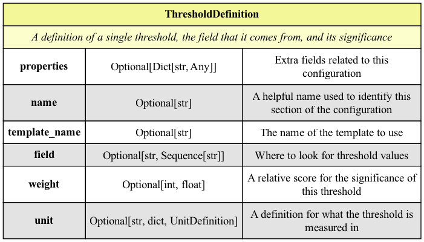

[Threshold Definitions](threshold.py) define what thresholds to apply to data, where to get their values, 
how to measure them, what to call them, and how important they are. Weights in these threshold definitions operate 
the same way as the weights for [Metric Specifications](#MetricSpecification), except values are relative to other 
threshold definitions, not metrics.

The name of a threshold is optional, but naming thresholds make their meaning simpler. For instance, the `p75_va` 
field in NWIS Statistical Thresholds represents the `75th Percetile`. Someone familiar with the dataset
may understand that raw definition, but someone _not_ familiar with these thresholds won't understand what it means.

<a id="ThresholdDefinitionExamples"></a>
### Examples

Use a threshold named `75th Percentile` with values from the `p75_va` field measured in `ft^3/s` with a weight of 10.
```json
{
    "name": "75th Percentile",
    "field": "p75_va",
    "weight": 10,
    "unit": {
        "value": "ft^3/s"
    }
}
```

<a id="ThresholdApplicationRules"></a>
## Threshold Application Rules

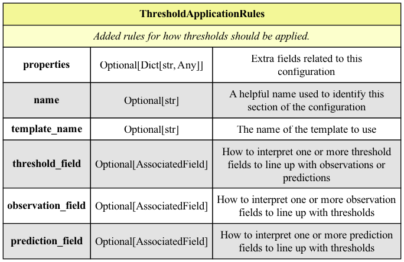

Thresholds and the data to evaluate may not always be in the same form or scale. USGS NWIS Statistical Thresholds, 
for example, are daily values, with each day defined by `day_nu` and `month_nu` integer values. Predicted or 
observed values, though, have their temporal values defined via year, month, day, hours, and seconds. In order
to link the correct thresholds to the correct values, [Threshold Application Rules](threshold.py) may be used to apply
transformations on different fields to ensure that thresholds may be correctly applied to evaluation data.

<a id="ThresholdApplicationRulesExamples"></a>
### Examples

Apply the threshold to observation data by creating two new columns, one named `threshold_day` in the threshold data
created by converting the `month_nu` and `day_nu` integer fields into one `Day` field, and another named
`threshold_day`, created by converting the `value_date` field into one `Day` field.
```json
{
    "name": "Date to Day",
    "threshold_field": {
        "name": "threshold_day",
        "path": [
            "month_nu",
            "day_nu"
        ],
        "datatype": "Day"
    },
    "observation_field": {
        "name": "threshold_day",
        "path": [
            "value_date"
        ],
        "datatype": "Day"
    }
}
```

`Day` is a `dmod.evaluations` specific type that describes a single day across any years, including leap years.
If I have a day of `10/1` and data for the years `2016`, `2017`, and `2018`, that `10/1` will be equivalent to
`2016-10-01`, `2017-10-01`, and `2018-10-01`.

A `Day` may be defined by passing a numerical day of the year, a string date, a python date type, a pandas date type, 
a numpy date type, or a series of numbers to use as input values representing the `[<numerical day of the year>]`,
`[<numerical month of the year>, <numerical day of the month>]`, or 
`[<year>, <numerical month of the year>, <numerical day of the month>]`. `[1]`, `[1, 1]`, and `[1975, 1, 1]` will 
all create the same `Day` value.

<a id="ThresholdSpecification"></a>
## Threshold Specification

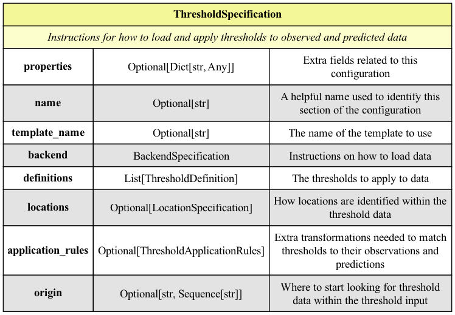

[Threshold Specifications](threshold.py) define how threshold data should be loaded, how to apply thresholds to data, 
and what thresholds to use.

<a id="ThresholdSpecificationExamples"></a>
### Example

The following two examples load an RDB file named `resources/nwis_stat_thresholds.rdb`,
names locations based off of the identified `site_no` column, matches loaded thresholds onto two new columns, the first
being `threshold_day` on the threshold data, created by converting the `month_nu` and `day_nu` fields into `Day` objects,
the second being named `threshold_day` on the observation data, created by converting the `value_date` field into
`Day` objects. Use the `p75_va`, `p80_va`, and `p50_va` fields as thresholds named `"75th Percentile"`,
`"80th Percentile"`, and `"Median"`, respectively, measured in `ft^3/s` and weighing `10`, `5`, and `1`, respectively.
The `75th Percentile` threshold will be considered 10 times more important than the `Median`, while the
`80th Percentile` will be considered half as important as the `75th Percentile`, but 5 times as important as the
`Median`.

```json
{
    "name": "NWIS Stat Percentiles",
    "backend": {
        "backend_type": "file",
        "format": "rdb",
        "address": "resources/nwis_stat_thresholds.rdb"
    },
    "locations": {
        "identify": true,
        "from_field": "column",
        "pattern": "site_no"
    },
    "application_rules": {
        "threshold_field": {
            "name": "threshold_day",
            "path": [
                "month_nu",
                "day_nu"
            ],
            "datatype": "Day"
        },
        "observation_field": {
            "name": "threshold_day",
            "path": [
                "value_date"
            ],
            "datatype": "Day"
        }
    },
    "definitions": [
        {
            "name": "75th Percentile",
            "field": "p75_va",
            "weight": 10,
            "unit": {
                "value": "ft^3/s"
            }
        },
        {
            "name": "80th Percentile",
            "field": "p80_va",
            "weight": 5,
            "unit": {
                "value": "ft^3/s"
            }
        },
        {
            "name": "Median",
            "field": "p50_va",
            "weight": 1,
            "unit": {
                "value": "ft^3/s"
            }
        }
    ]
}
```

The following example can produce the exact same results as the example from above but through the use of templates.

```json
{
    "backend": {
        "template_name": "NWIS Stat Thresholds"
    },
    "locations": {
        "template_name": "Site Number Column"
    },
    "application_rules": {
        "template_name": "Date to Day"
    },
    "definitions": [
        {
            "template_name": "75th Percentile"
        },
        {
            "template_name": "80th Percentile"
        },
        {
            "template_name": "Median"
        }
    ]
}
```

<a id="UnitDefinition"></a>
## Unit Definition

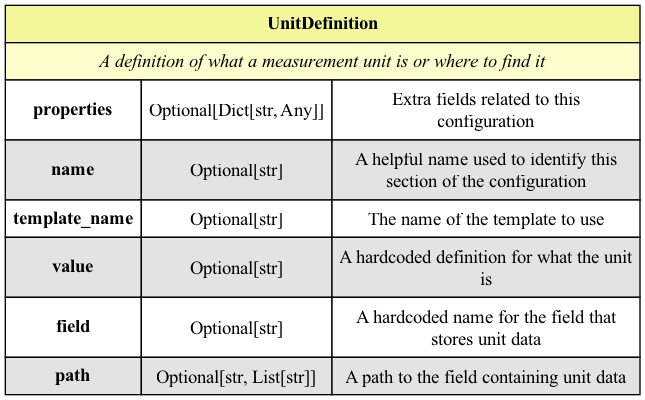

[Unit Definitions](unit.py) tell the system how to interpret the values from data sources. Predictions, for instance, 
may be expressed in cubic meters per second (`cms`), while observations may be expressed in cubic _feet_ per second 
(`ft^3/s`). Values in `cms` and `ft^3/s` aren't immediately comparable, so the units need to be explicitly stated in 
case of a necessary set of unit conversions. There are three options for how to get the unit. If the `value` of `cms`
is dictated, the system will interpret all primary values from the datasource as being measured in `cms`. If the 
`field` of `unit` is dictated, the unit will be interpreted as whatever lies within the `unit` field of the 
selected data. The former option is great for cases where the unit isn't in the dataset and is instead known via 
institutional knowledge, while the former is great for cases where the unit _is_ in the dataset.

Any type of unit may be used, but unit conversions will occur if units are not the same. When these conversions take place,
only the stock units available in [Pint](https://github.com/hgrecco/pint/blob/master/pint/default_en.txt), along with
m3, ft3, cms, cfs, and KCFS (case insensitive), may be used.

<a id="UnitDefinitionExamples"></a>
### Examples

Use the values in the `unit` field as the name of the measurement unit:
```json
{
    "field": "unit"
}
```

Use the value `"ft^3/s"` as the unit of measurement for every piece of data loaded in this context:
```json
{
    "value": "ft^3/s"
}
```


<a id="MetricSpecification"></a>
## Metric Specification

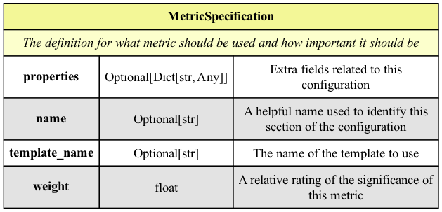

[Metric Specifications](scoring.py) merely define what metric is intended to be used and how important it is. The 
`weight` value only bears significance to _other_ defined `weight` values. If only one Metric Specification is
defined, the `weight` doesn't have much value since there isn't anything to compare it to. It's similar in the case
where _all_ defined Metric Specifications have the same weight - in this case the results are all equally important.

The weight becomes significant when there are varying weight values. Given Metric Specifications with weights `1`, 
`2`, `3`, and `4`, the last Metric Specification is considered as being the most important metric while the first is 
the least important. When scores are averaged, that last metric will have a far greater impact on the results than the 
first metric.

Since the values are all relative, changing the above weights to `4`, `8`, `12`, and `16` will bear the same results.

There are no rules for how `weight` values are defined. They may be arbitrarily high or arbitrarily low. The 
importance is that they relate to one another.

<a id="MetricSpecificationExamples"></a>
### Example

Use the metric named "Pearson Correlation Coefficient" with a relative weight of `10`
```json
{
    "name": "Pearson Correlation Coefficient",
    "weight": 10
}
```

Use the metric named "pRoBabIliTyOfDeTecTiOn" with a relative weight of `4`
```json
{
    "name": "pRoBabIliTyOfDeTecTiOn",
    "weight": 4
}
```

Using the above two examples at the same time will tell the evaluation that the result of the
"Pearson Correlation Coefficient" is 250% more important than the result of "Probability of Detection"

<a id="SchemeSpecification"></a>
## Scheme Specification

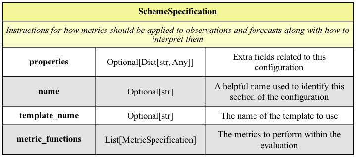

A [Scheme Specification](scoring.py) defines the overall scoring scheme for the entire evaluation. It dictates what 
metrics to use and how important they are in comparison.

<a id="SchemeSpecificationExamples"></a>
### Examples

Use the metrics "Pearson Correlation Coefficient", "Normalized Nash-Sutcliffe Efficiency",
"Kling-Gupta Efficiency", "Probability of Detection", and "False Alarm Ratio", but consider "Pearson Correlation Coefficient"
as the most important metric, followed by "Normalized Nash-Sutcliffe Efficiency" and "Kling-Gupta Efficiency", then followed by
"False Alarm Ratio" and "Probability of Detection".

```json
{
    "metrics": [
        {
            "name": "False Alarm Ratio",
            "weight": 10
        },
        {
            "name": "Probability of Detection",
            "weight": 10
        },
        {
            "name": "Kling-Gupta Efficiency",
            "weight": 15
        },
        {
            "name": "Normalized Nash-Sutcliffe Efficiency",
            "weight": 15
        },
        {
            "name": "Pearson Correlation Coefficient",
            "weight": 18
        }
    ]
}
```

<a id="DataSourceSpecificationExamples"></a>
### Data Source Specification Examples
The following examples all describe the exact same datasource.

The primary field for this data source will be called `observation`, which will be populated by retrieving all values
from `values[*].value[*].value` relative to `$.value.timeSeries[*]` and interpreting them as `float`s. Each of these
`observation` values will be accompanied by their corresponding `dateTime` found at `values[*].value[*].dateTime`,
the location identifier at `sourceInfo.siteCode[0].value`, and the unit of measurement at `variable.unit.unitCode`,
all relative to `$.value.timeSeries[*]`.

The data will be loaded from a JSON file at "resources/observations.js".

The locations will are found in the `observation_location` field and the measurement unit will be found in the `unit`
field.

The data will be paired and evaluated by a matching `value_date` value.

A full configuration using no templates
```json
{
    "value_field": "observation",
    "value_selectors": [
        {
            "name": "observation",
            "where": "value",
            "path": ["values[*]", "value[*]", "value"],
            "datatype": "float",
            "origin": ["$", "value", "timeSeries[*]"],
            "associated_fields": [
                {
                    "name":"value_date",
                    "path": ["values[*]", "value[*]", "dateTime"],
                    "datatype": "datetime"
                },
                {
                    "name":"observation_location",
                    "path": ["sourceInfo", "siteCode", "[0]", "value"],
                    "datatype": "string"
                },
                {
                    "name":"unit",
                    "path": ["variable", "unit", "unitCode"],
                    "datatype": "string"
                }
            ]
        }
    ],
    "backend": {
        "backend_type": "file",
        "format": "json",
        "address": "resources/observations.json"
    },
    "locations": {
        "identify": true,
        "from_field": "observation_location"
    },
    "unit": {
        "field": "unit"
    },
    "x_axis": "value_date"
}
```

This configuration may be simplified by utilizing a few templates. The first template used, `JSON File`, simplifies
the definition for how to load JSON files by only requiring a path to the file. The second template used,
`From Observation` lets you bypass the configuration for a location by just using the common declaration.

```json
{
    "value_field": "observation",
    "value_selectors": [
        {
            "name": "observation",
            "where": "value",
            "path": ["values[*]", "value[*]", "value"],
            "datatype": "float",
            "origin": ["$", "value", "timeSeries[*]"],
            "associated_fields": [
                {
                    "name":"value_date",
                    "path": ["values[*]", "value[*]", "dateTime"],
                    "datatype": "datetime"
                },
                {
                    "name":"observation_location",
                    "path": ["sourceInfo", "siteCode", "[0]", "value"],
                    "datatype": "string"
                },
                {
                    "name":"unit",
                    "path": ["variable", "unit", "unitCode"],
                    "datatype": "string"
                }
            ]
        }
    ],
    "backend": {
        "template_name": "JSON File",
        "address": "resources/observations.json"
    },
    "locations": {
        "template_name": "From Observation"
    },
    "unit": {
        "field": "unit"
    },
    "x_axis": "value_date"
}
```

Templates may be used for just about every field. The most complicated aspect of the above configuration was the
complexity of parsing NWIS JSON WaterML responses. All of that may be bypassed by instead using the `NWIS Record`
template, which will supply the full and correct queries for every field needed when using that format. When available,
no user should need to define any of that themselves.

```json
{
    "value_field": "observation",
    "value_selectors": [
        {
            "template_name": "NWIS Record"
        }
    ],
    "backend": {
        "template_name": "JSON File",
        "address": "resources/observations.json"
    },
    "locations": {
        "template_name": "From Observation"
    },
    "unit": {
        "field": "unit"
    },
    "x_axis": "value_date"
}
```

<a id="EvaluationSpecificationExamples"></a>
### Evaluation Specification Examples

The following examples all describe the exact same evaluation:

A full configuration using no templates
```json
{
    "observations": [
        {
            "name": "Observations",
            "value_field": "observation",
            "value_selectors": [
                {
                    "name": "observation",
                    "where": "value",
                    "path": ["values[*]", "value[*]", "value"],
                    "datatype": "float",
                    "origin": ["$", "value", "timeSeries[*]"],
                    "associated_fields": [
                        {
                            "name":"value_date",
                            "path": ["values[*]", "value[*]", "dateTime"],
                            "datatype": "datetime"
                        },
                        {
                            "name":"observation_location",
                            "path": ["sourceInfo", "siteCode", "[0]", "value"],
                            "datatype": "string"
                        },
                        {
                            "name":"unit",
                            "path": ["variable", "unit", "unitCode"],
                            "datatype": "string"
                        }
                    ]
                }
            ],
            "backend": {
                "backend_type": "file",
                "format": "json",
                "address": "resources/observations.json"
            },
            "locations": {
                "identify": true,
                "from_field": "value"
            },
            "unit": {
                "field": "unit"
            },
            "x_axis": "value_date"
        }
    ],
    "predictions": [
        {
            "name": "Predictions",
            "value_field": "prediction",
            "value_selectors": [
                {
                    "name": "predicted",
                    "where": "column",
                    "associated_fields": [
                        {
                            "name": "date",
                            "datatype": "datetime"
                        }
                    ]
                }
            ],
            "backend": {
                "backend_type": "file",
                "format": "csv",
                "address": "resources/cat.*cfs.csv",
                "parse_dates": ["date"]
            },
            "locations": {
                "identify": true,
                "from_field": "filename",
                "pattern": "cat-\\d\\d"
            },
            "field_mapping": [
                {
                    "field": "prediction",
                    "map_type": "column",
                    "value": "predicted"
                },
                {
                    "field": "prediction_location",
                    "map_type": "column",
                    "value": "location"
                },
                {
                    "field": "value_date",
                    "map_type": "column",
                    "value": "date"
                }
            ],
            "unit": {
                "value": "ft^3/s"
            },
            "x_axis": "value_date"
        }
    ],
    "crosswalks": [
        {
            "name": "Crosswalk",
            "backend": {
                "backend_type": "file",
                "address": "resources/crosswalk.json",
                "format": "json"
            },
            "observation_field_name": "observation_location",
            "prediction_field_name": "prediction_location",
            "field": {
                "name": "prediction_location",
                "where": "key",
                "path": ["* where site_no"],
                "origin": "$",
                "datatype": "string",
                "associated_fields": [
                    {
                        "name": "observation_location",
                        "path": "site_no",
                        "datatype": "string"
                    }
                ]
            }
        }
    ],
    "thresholds": [
        {
            "name": "NWIS Stat Percentiles",
            "backend": {
                "name": "NWIS Stat Thresholds",
                "backend_type": "file",
                "format": "rdb",
                "address": "resources/nwis_stat_thresholds.rdb"
            },
            "locations": {
                "identify": true,
                "from_field": "column",
                "pattern": "site_no"
            },
            "application_rules": {
                "name": "Date to Day",
                "threshold_field": {
                    "name": "threshold_day",
                    "path": [
                        "month_nu",
                        "day_nu"
                    ],
                    "datatype": "Day"
                },
                "observation_field": {
                    "name": "threshold_day",
                    "path": [
                        "value_date"
                    ],
                    "datatype": "Day"
                }
            },
            "definitions": [
                {
                    "name": "75th Percentile",
                    "field": "p75_va",
                    "weight": 10,
                    "unit": {
                        "value": "ft^3/s"
                    }
                },
                {
                    "name": "80th Percentile",
                    "field": "p80_va",
                    "weight": 5,
                    "unit": {
                        "value": "ft^3/s"
                    }
                },
                {
                    "name": "Median",
                    "field": "p50_va",
                    "weight": 1,
                    "unit": {
                        "value": "ft^3/s"
                    }
                }
            ]
        }
    ],
    "scheme": {
        "name": "Prefer Pearson, then Nash and Kling, then POD and FAR",
        "metrics": [
            {
                "name": "False Alarm Ratio",
                "weight": 10
            },
            {
                "name": "Probability of Detection",
                "weight": 10
            },
            {
                "name": "Kling-Gupta Efficiency",
                "weight": 15
            },
            {
                "name": "Normalized Nash-Sutcliffe Efficiency",
                "weight": 15
            },
            {
                "name": "Pearson Correlation Coefficient",
                "weight": 18
            }
        ]
    }
}
```

A configuration using templates

```json
{
    "observations": [
        {
            "template_name": "REST Observations",
            "backend": {
                "params": {
                    "sites": "0214657975,0214655255",
                    "startDT": "2022-12-01T00:00%2b0000",
                    "endDT": "2022-12-31T00:00%2b0000"
                }
            }
        }
    ],
    "predictions": [
        {
            "template_name": "Predictions"
        }
    ],
    "crosswalks": [
        {
            "template_name": "Templated Crosswalk"
        }
    ],
    "thresholds": [
        {
            "template_name": "All Templates for NWIS Stat Percentiles"
        }
    ],
    "scheme": {
        "template_name": "Prefer Pearson, then Nash and Kling, then POD and FAR"
    }
}
```

A configuration using templates with overridden values

```json
{
    "observations": [
        {
            "template_name": "Observations from Templates"
        }
    ],
    "predictions": [
        {
            "template_name": "Predictions"
        }
    ],
    "crosswalks": [
        {
            "template_name": "Templated Crosswalk"
        }
    ],
    "thresholds": [
        {
            "template_name": "All Templates for NWIS Stat Percentiles"
        }
    ],
    "scheme": {
        "template_name": "Prefer Pearson, then Nash and Kling, then POD and FAR"
    }
}
```

<a id="all-elements"></a>
## All Elements

When put together, the entire object tree looks like:

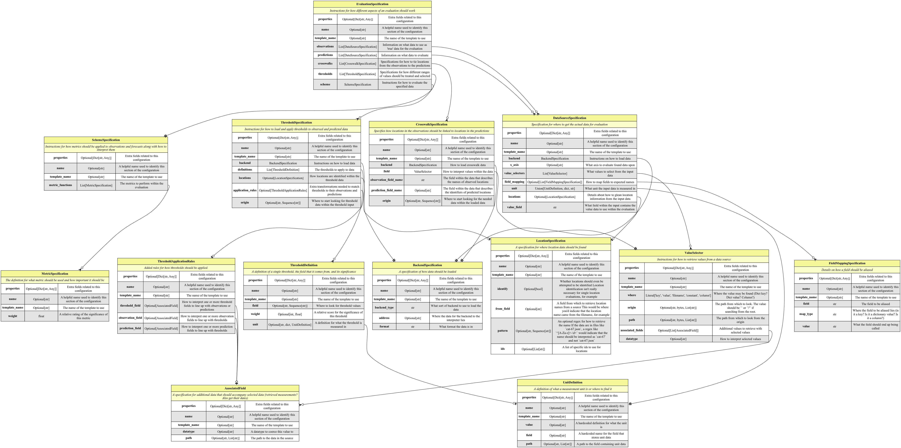