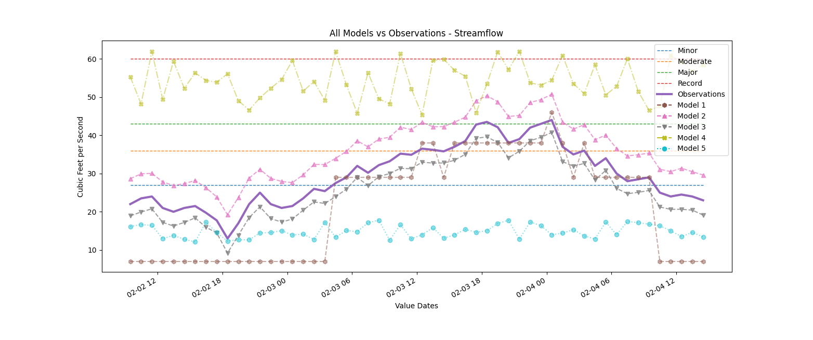
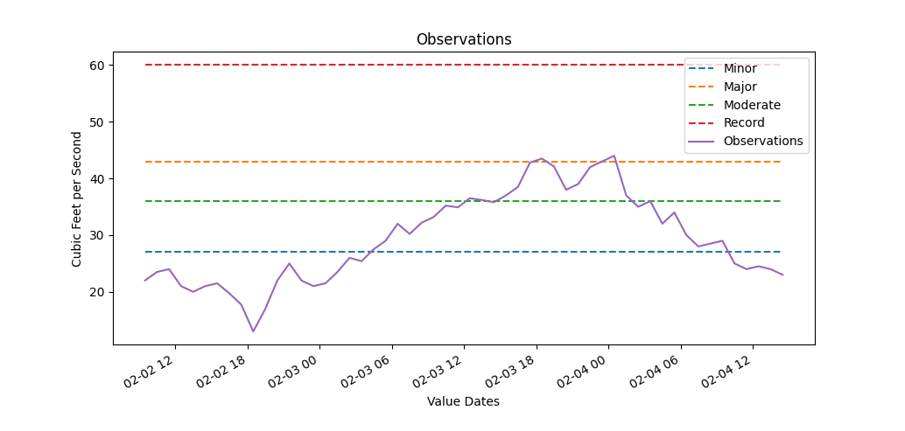
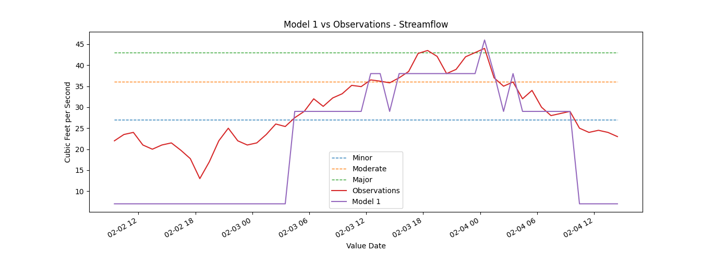
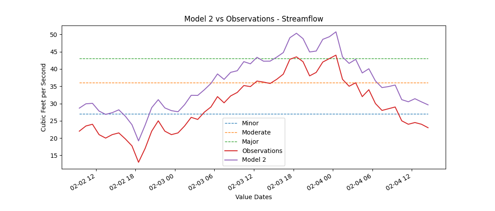
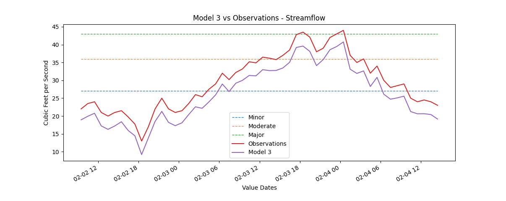
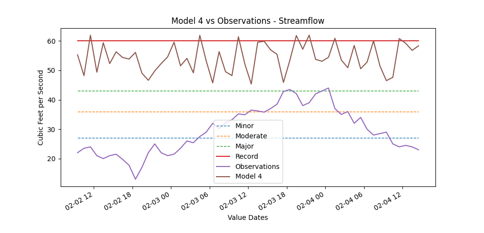
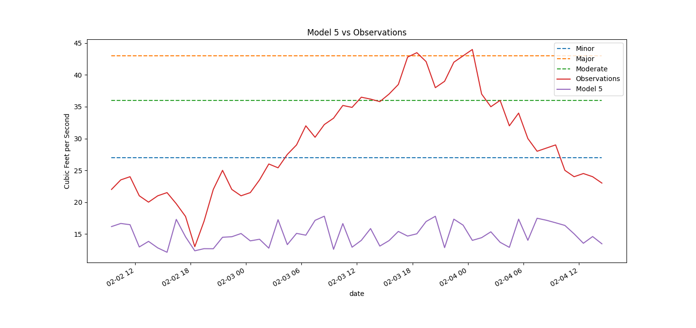

# Metrics Testing

## Thresholds

There are four thresholds used for testing:

| Name | Value |
|------|-------|
| All | 0 CFS |
| Minor | 27 CFS |
| Moderate | 36 CFS |
| Major | 43 CFS |
| Record | 60 CFS |

These were made up for testing and have no real world source.

## Datasets

### Observations

**File:** [observations.csv](observations.csv)

Test Observations were generated based on a rough curve, making sure that it starts under a fully defined threshold, 
up through all of them, then back down a little. These values don't match up with any real location and are used for 
example's sake only.

### Model 1

**File:** [model_1.csv](model_1.csv)

Model 1 was designed to have near perfect behavior in relation to thresholds, with little to no movement outside of it. 
Categorical metrics should be spot on with others very much left to be desired.

### Model 2

**File:** [model_2.csv](model_2.csv)

Model 2 was designed to mimic the observations _almost_ perfectly, except overpredicted. This _should_ yield good 
numbers in relation to how well the curve mimics the observations, but yield false positives.

### Model 3

**File:** [model_3.csv](model_3.csv)

Model 3 is a mirror to Model 2 in that it underpredicts instead. The gap between the values in Model 3 are smaller 
than those in Model 2. While Model 3 does not produce false positives like Model 2, it _does_ produce misses.

### Model 4

**File:** [model_4.csv](model_4.csv)

Model 4 was designed to _not_ mimic any sort of movement from the observations and to always greatly overpredict. 
This is the only dataset to exceed Record flow.

### Model 5

**File:** [model_5.csv](model_5.csv)

Model 5 is a counterpart to Model 4, except, instead of always being too high it is always too low. Model 5 does not 
mimic the observations behavior and never crosses into the Minor threshold or beyond.

